基于servlet+jsp的在线鲜花销售系统

框架：jsp+servlet+mysql+bootstrap

CSDN博客地址：https://blog.csdn.net/m0_47220500/article/details/125133740

B站运行视频：暂无

项目下载地址：http://shiyuncode.com/details?id=4

运行截图：

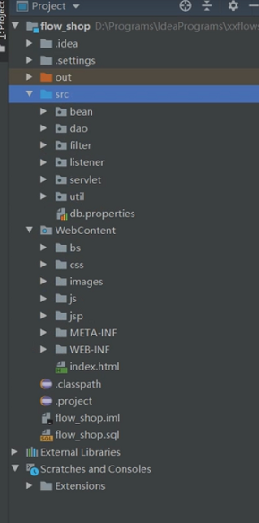
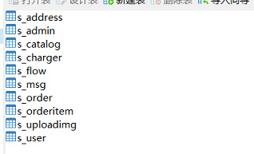

管理员：
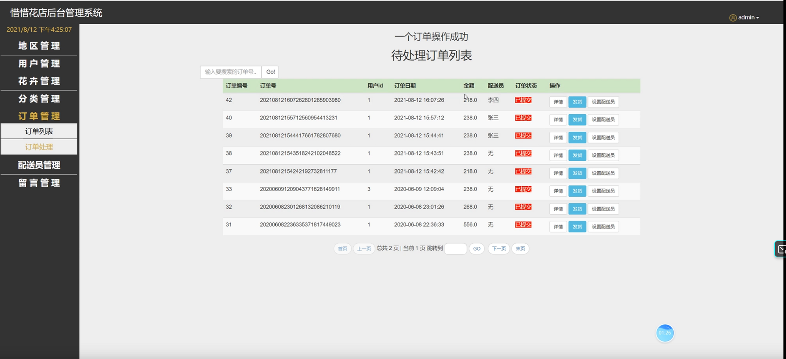
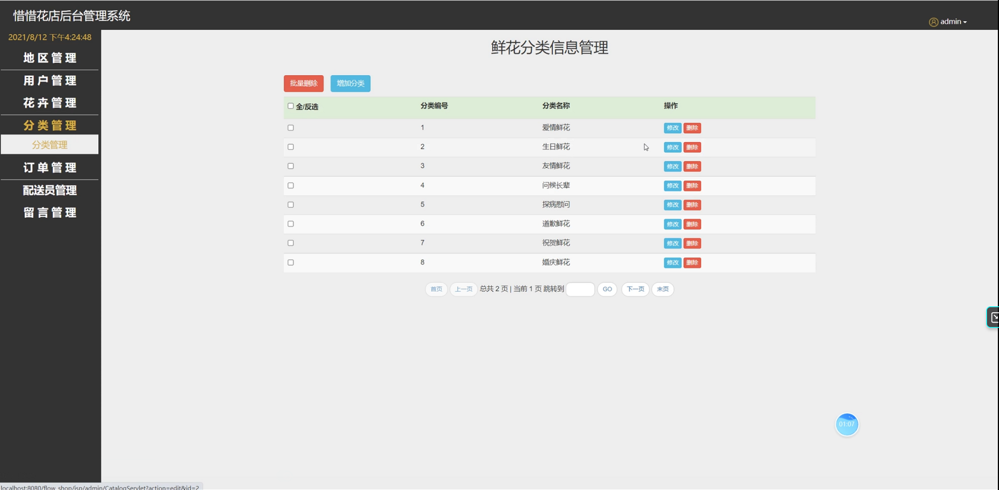
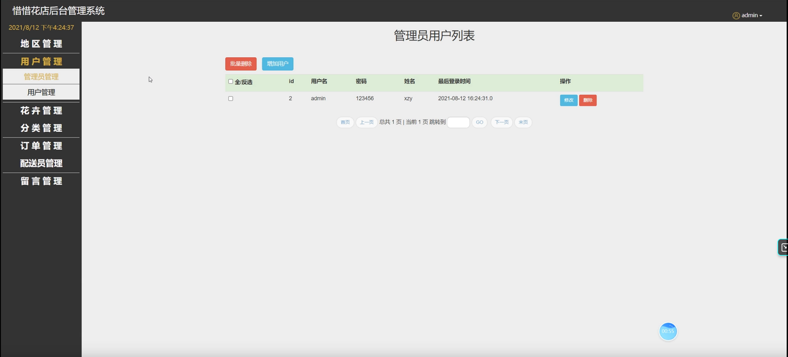
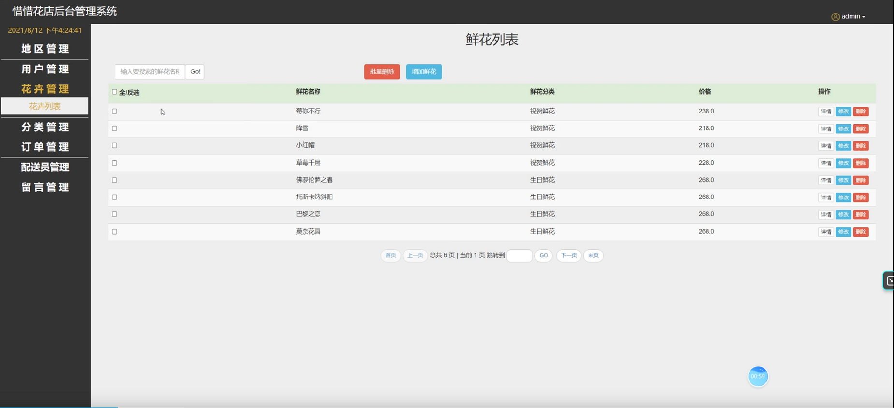
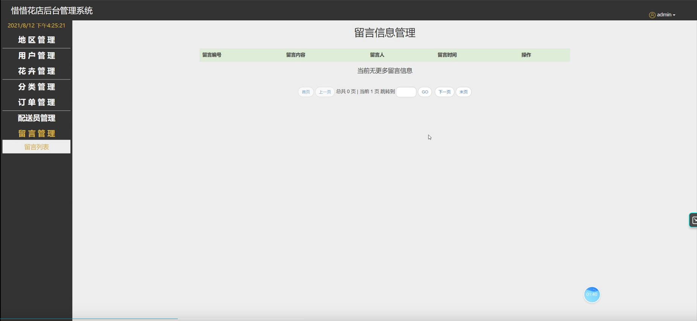
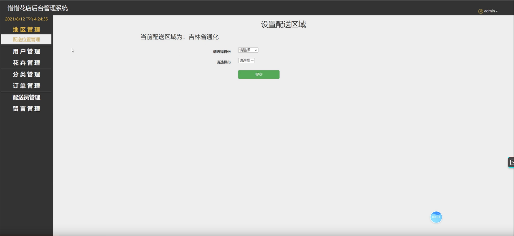
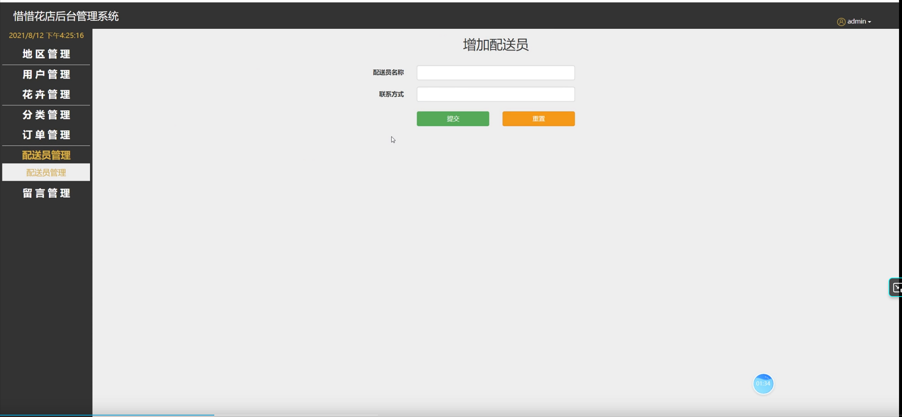
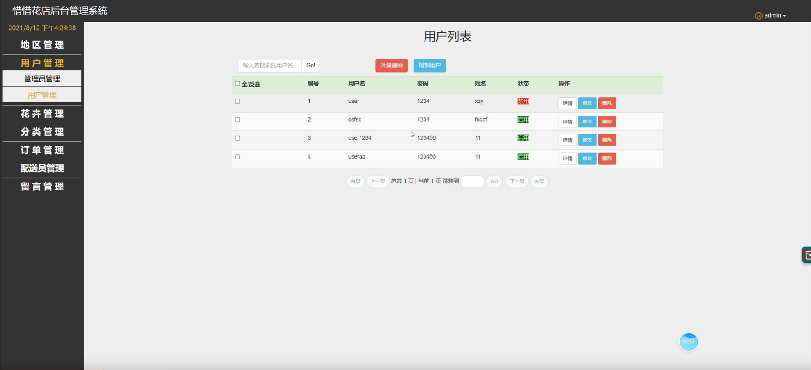

用户：

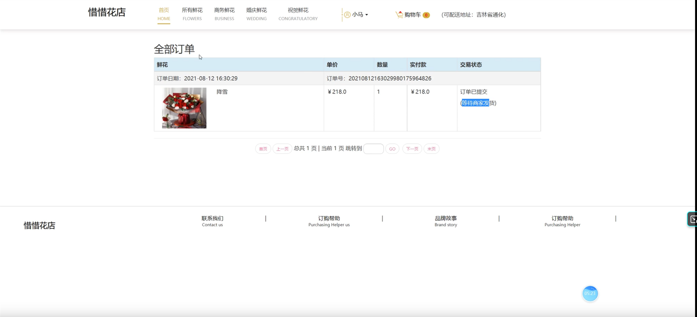
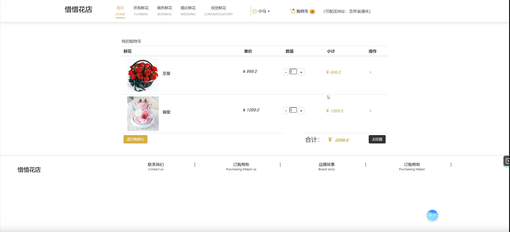
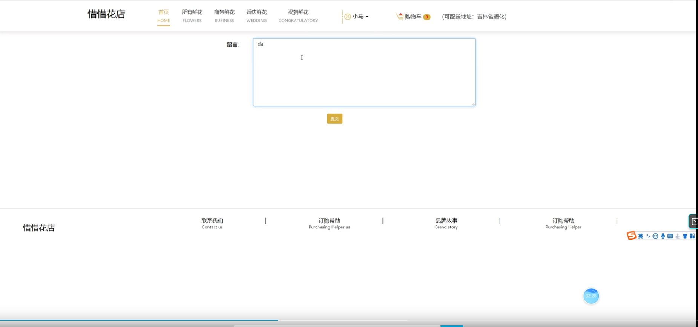
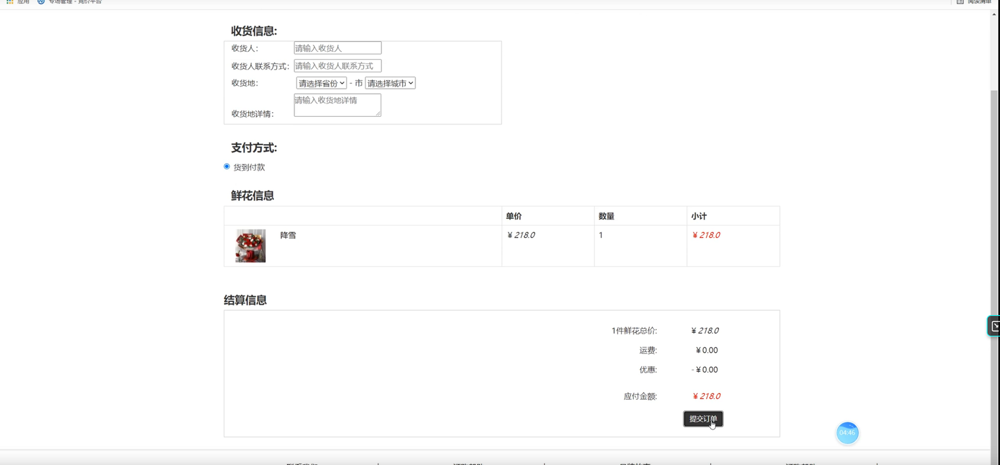

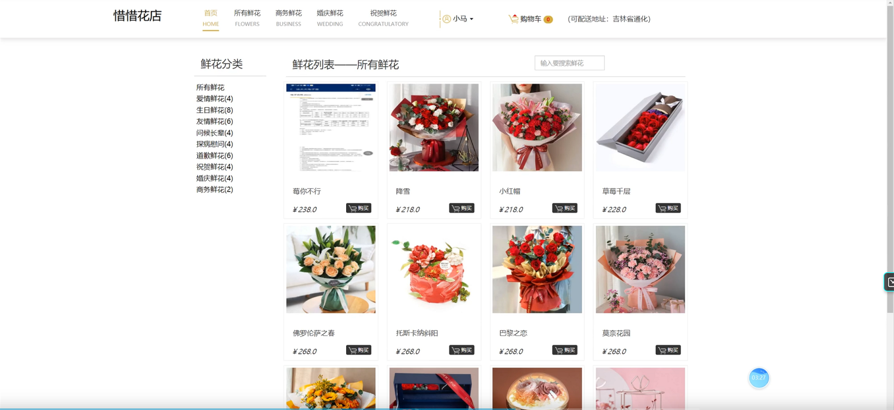

功能：

1.用户：登录注册、购物车增删、提交订单、我的订单、鲜花分类查询模糊查询、留言、确认收货、编辑收货地址等

2.管理员：订单管理、分类管理、花卉管理、用户管理、留言管理、配送员管理、配送地址管理等
